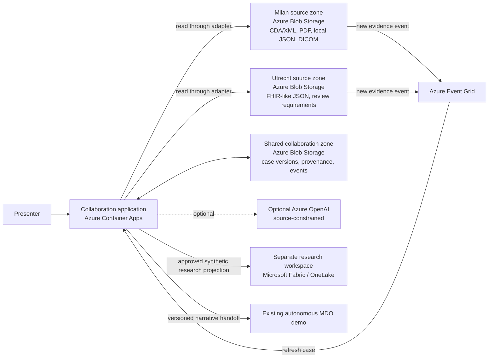
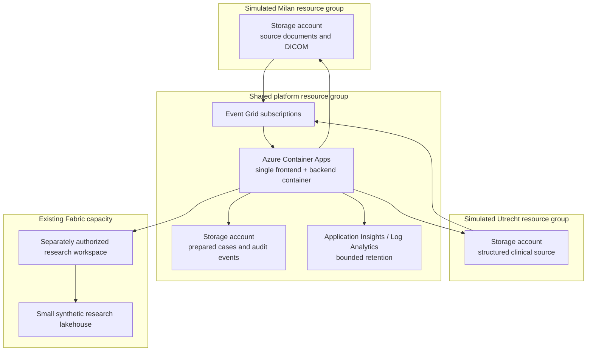

# Architecture proposal: European oncology collaboration demo

**Status:** Approved for implementation planning
**Version:** 0.1
**Date:** 2026-09-23
**Architecture approval required before:** Implementation or Azure provisioning

## Recommendation

Build one small web application in Azure Container Apps, backed by three isolated Blob Storage zones:

1. a simulated Milan institutional source;
2. a simulated Utrecht institutional source;
3. a shared collaboration store for prepared case versions, provenance, events, and handoff records.

Use Event Grid to notify the application when new evidence arrives. Use Microsoft Fabric only for the separately authorized research epilogue, on the existing Fabric capacity. Do not use Azure Health Data Services in version one.

The application should have a deterministic rehearsal runtime and an optional source-constrained Azure OpenAI runtime behind the same interface. Live AI is not required for the first useful demonstration and may be added only after cost and behavior approval.

## Why this is the simplest sufficient architecture

- Blob Storage preserves genuinely different source files without forcing premature normalization.
- Two institutional adapters provide a real seam because the sources actually vary.
- A single application deployable avoids microservices, queues, workflow engines, and distributed state.
- Event Grid makes late imaging arrival real and automatic without continuous polling.
- A shared collaboration store preserves prepared case versions and provenance separately from institutional sources.
- Fabric is strong for analytics, cohort exploration, governance, and the research narrative, but it is not required for low-latency clinical workflow state.
- Azure Health Data Services would add production-grade FHIR/DICOM interfaces, cost, identity, and operational complexity that the synthetic demonstration does not need.

## Context diagram

## Deployment view

The diagrams describe logical isolation for the demonstration. They do not claim to reproduce the real systems, tenancy, permissions, or governance of the named institutions.

## Deep modules and seams

### Expert discovery module

**Interface:** Given a clinical need, return bounded, explainable centre/team matches and eligible fictional clinicians.

The implementation owns:

- synthetic expert-centre data;
- clinical-specialty and evidence-requirement matching;
- match explanations;
- referral-pathway conditions;
- explicit coverage limitations.

The caller does not need to know how rankings are calculated or how the directory is stored.

### Institution source seam

**Interface:** Read a source snapshot and source evidence for a case.

Two adapters make this a real seam:

- **Milan adapter:** CDA/XML, PDF/pathology text, local codes, DICOM files and metadata.
- **Utrecht adapter:** FHIR-like JSON, expert-review requirements, and structured review state.

Adapters preserve original values and return a common evidence envelope containing:

- source institution;
- source identifier;
- source format;
- observed time;
- received time;
- content hash;
- transformation status;
- parsed facts;
- warnings and unmapped values;
- source retrieval reference.

### Case preparation module

**Interface:** Prepare or refresh one case version from the available institutional evidence.

The implementation owns:

- merging without erasing source disagreement;
- longitudinal ordering;
- missingness and conflict detection;
- source-linked summaries;
- evidence completeness against the selected centre's referral requirements;
- versioning and change detection;
- deterministic rehearsal output;
- optional AI assistance through an internal runtime seam.

This is the deepest product module. The UI should not independently merge, infer, or resolve clinical evidence.

### Assistance runtime seam

**Interface:** Produce bounded synthesis from an explicit evidence package and schema.

Adapters:

- **Rehearsal adapter:** deterministic curated output for reliable demonstration.
- **Azure OpenAI adapter:** optional structured synthesis constrained to supplied evidence.

The runtime cannot approve a referral, determine resectability, or record human concurrence. Failures remain visible and never fall back silently.

### Collaboration workflow module

**Interface:** Apply a valid user action to a case version and return the resulting state.

The implementation owns:

- referral initiation;
- evidence-request state;
- reviewer responsibility;
- case-version transitions;
- human opinion and conditions;
- next-action ownership;
- immutable event history;
- readiness for MDO handoff.

### MDO handoff module

**Interface:** Create a versioned handoff manifest from an approved prepared case.

The manifest contains:

- shared synthetic case ID;
- clinical question;
- case version;
- source evidence inventory;
- unresolved issues;
- responsibility state;
- handoff timestamp;
- demonstration-only label.

Version one may launch or deep-link to the existing MDO with a matching case and visual continuity. It must not imply shared backend state.

### Research projection module

**Interface:** Publish an explicitly approved synthetic research projection and return a receipt.

The implementation owns:

- separation from clinical access;
- removal of workflow-only data;
- projection version and purpose;
- publication to the separately authorized Fabric workspace;
- lineage back to synthetic source records.

Fabric is not queried by the clinical workflow. This prevents research analytics from becoming an operational dependency.

## Data and source design

### Milan source

Proposed synthetic contents:

- CDA/XML referral or discharge document;
- PDF pathology report represented both as the original file and extracted text;
- local-code treatment history;
- baseline CT DICOM study;
- later restaging liver MRI DICOM study;
- one deliberate identifier or date mismatch;
- incomplete molecular panel at initial referral.

### Utrecht source

Proposed synthetic contents:

- FHIR-like JSON resources for the received referral;
- centre and clinician capability profile;
- evidence requirements for liver-metastasis review;
- review state and responsibility records.

### Shared collaboration data

- prepared case snapshots;
- provenance graph;
- missingness and conflict findings;
- evidence update events;
- human opinions and next actions;
- handoff manifest;
- presentation mode and audit metadata.

No source record is overwritten by normalized data.

## Imaging approach

Store a small synthetic DICOM dataset in the Milan source zone. Extract only the metadata and image frames needed by the demonstration. Use a browser-capable DICOM viewer library or rendered derived images while preserving links to the original DICOM objects.

Azure Health Data Services DICOM service is deferred because:

- the demo has a tiny fixed synthetic dataset;
- no real DICOMweb integration is required;
- Blob Storage can preserve and serve the source objects;
- the application can model arrival and provenance without a managed imaging archive;
- avoiding it reduces services, permissions, cost, and setup.

Reconsider it only if a real DICOMweb client, hospital imaging exchange, or reusable imaging archive becomes an approved requirement.

## Fabric role

Use the existing Fabric capacity only for the research epilogue:

- a separate workspace with separate permissions;
- a small Lakehouse containing an approved synthetic projection;
- a prebuilt cohort-feasibility or population-availability view;
- explicit lineage and purpose labels;
- no automatic access from the clinical role.

Fabric Data Factory or Real-Time Intelligence is not required for the core demo. The application can publish a small versioned projection directly. Add Fabric pipelines only if repeated data preparation proves necessary.

## Security and identity

Proposed demonstration model:

- protect the deployed application with Microsoft Entra authentication for the presenter;
- use managed identity from Container Apps to the three storage accounts;
- disable public write access on storage;
- represent Italian clinician, Utrecht clinician, clinical workspace, and research workspace roles as clearly labeled synthetic authorization contexts;
- keep real identity and credential federation out of scope;
- record all state-changing presenter actions;
- store no real patient or personal data.

The Entra application and group design is an architecture approval item. It is not permission to create identities or role assignments.

## Reliability and demonstration behavior

- One active presenter session and one active synthetic case are sufficient.
- Use a single Container Apps replica by default; scale-to-zero is acceptable outside rehearsals.
- Persist every accepted state transition before returning success.
- Use optimistic version checks to reject stale updates.
- Keep deterministic rehearsal independent of Azure OpenAI.
- Preflight all source files and the MDO link before a presentation.
- Make source, AI, storage, and handoff failures visible.
- Do not retry state-changing actions without idempotency keys.

## Observability

Record:

- request and workflow latency;
- source reads and parse outcomes;
- case-version transitions;
- Event Grid delivery and refresh outcomes;
- AI runtime mode, duration, and bounded usage metadata;
- Fabric projection receipt;
- MDO handoff creation.

Exclude synthetic clinical content from ordinary logs. Use short retention, sampling, and a daily ingestion cap to avoid uncontrolled monitoring cost.

## Cost assessment

No spend is approved by this document.

| Item | Expected demo usage | Cost character | Main drivers |
| --- | --- | --- | --- |
| Container Apps consumption | One small app, scale-to-zero outside rehearsals | Low; may fit largely within subscription free grants | Active vCPU/memory seconds, requests, minimum replicas |
| Three Blob Storage accounts | Small synthetic dataset, limited DICOM files | Very low | Stored GB, read/list operations, redundancy, egress |
| Event Grid | A few evidence-arrival events per demo | Negligible | Operations delivered |
| Application Insights / Log Analytics | Low-volume operational telemetry | Low but potentially unpredictable if uncapped | Ingested GB and retention |
| Existing Fabric capacity | Small research workspace and projection | No new capacity purchase assumed; consumes shared capacity | Capacity contention, storage, refresh frequency |
| Optional Azure OpenAI | Bounded case synthesis | Usage-based and potentially variable | Model, input/output tokens, repetitions |

Before deployment, create a region-specific Azure Pricing Calculator estimate and obtain explicit approval for:

- expected monthly maximum;
- any minimum replica;
- monitoring ingestion cap;
- Fabric workspace use on the shared capacity;
- Azure OpenAI model and token budget.

## Alternatives considered

### Azure Health Data Services as the core

**Not recommended for version one.** It offers appropriate production-oriented FHIR and DICOM capabilities but adds interfaces, permissions, costs, and operational work that do not improve the approved synthetic demonstration enough.

### Fabric as the full operational backend

**Not recommended.** Fabric is optimized for integration, analytics, and data products. The clinician-facing workflow needs low-latency transactional state, event handling, and presentation-specific behavior. Making Fabric operationally central would couple the demo to capacity availability and analytics concepts without removing the need for an application backend.

### Fabric for research only

**Recommended.** It demonstrates the broader platform vision using existing capacity while preserving a strong authorization and workload separation.

### Local-only backend

**Rejected.** It would weaken the intended demonstration of real cross-institution Azure-backed evidence flow.

### Multiple microservices or agent services

**Rejected.** One deployable with deep internal modules is sufficient and substantially easier to test, operate, rehearse, and explain.

## Architecture decisions requiring approval

1. Use Container Apps plus three Blob Storage zones and Event Grid for the core.
2. Exclude Azure Health Data Services from version one.
3. Use existing Fabric capacity only for the research epilogue.
4. Use one deployable application with internal deep modules rather than microservices.
5. Use Entra authentication for the presenter while keeping cross-border clinician identities explicitly synthetic.
6. Preserve a deterministic rehearsal runtime; make Azure OpenAI optional and separately approved.
7. Use a narrative, versioned MDO handoff rather than backend integration.

## Approval record

**Decision:** Approved architecture proposal version 0.1 for implementation planning.
**Approver:** User
**Date:** 2026-09-23
**Approved scope:** Container Apps application; Milan, Utrecht, and shared Blob Storage zones; Event Grid evidence updates; existing Fabric capacity for research only; no Azure Health Data Services; presenter Entra access with simulated clinician roles; deterministic rehearsal; optional separately approved Azure OpenAI; narrative MDO handoff.
**Not approved:** Azure provisioning, deployment, identity creation, role assignments, Fabric workspace creation or modification, Azure OpenAI usage, or ongoing cloud spend.
**Re-approval conditions:** Material change to the operational backend, source-isolation model, identity model, Fabric role, AI runtime, MDO integration, or meaningful cost profile.
