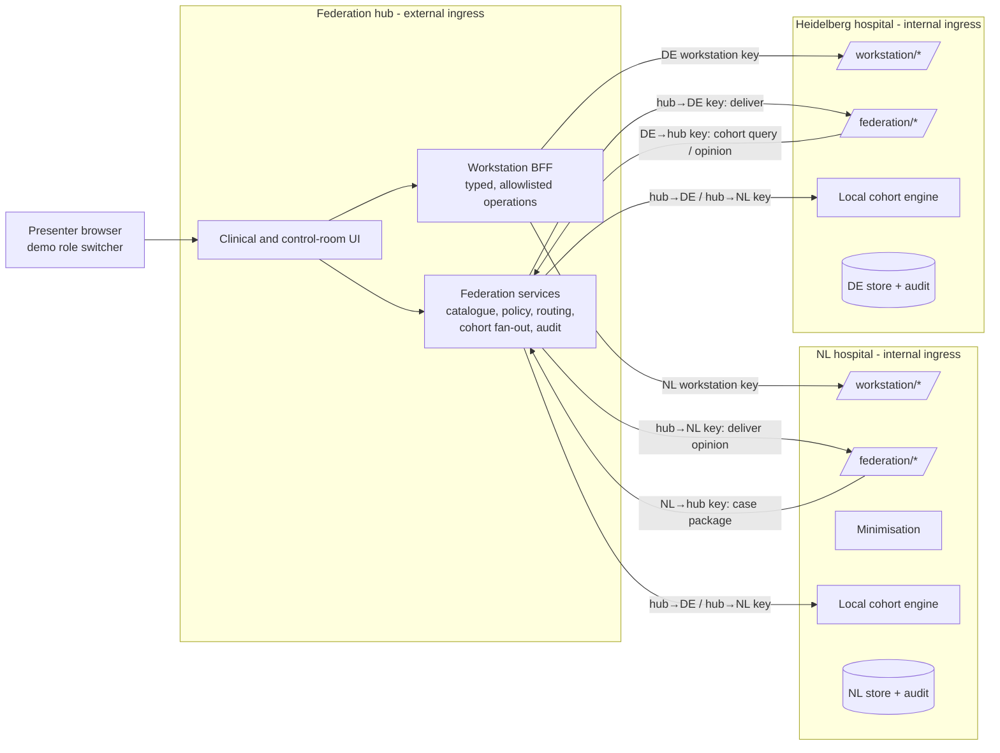
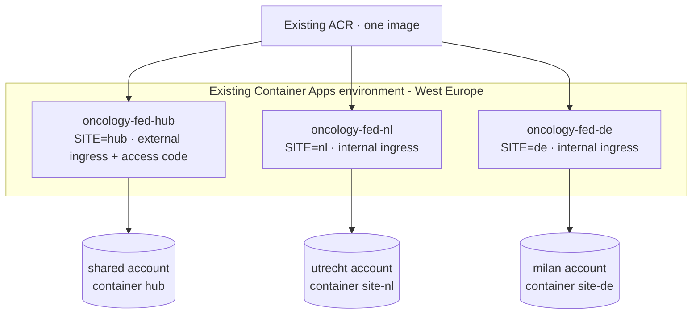

# Architecture: federated European oncology network (v0.3)

**Status:** Approved by @cammeleon66 on 2026-09-24 ("yes go for it!"); the
product owner delegated open choices ("for where you are insecure just go").
**Date:** 2026-09-24
**Decision:** ADR-017 (below); supersedes the navigation part of ADR-016 and
the single-application recommendation of `architecture-proposal.md` v0.1.
**Product intent:** [`../product/federated-network-proposal.md`](../product/federated-network-proposal.md)
(DEC-017 to DEC-020, approved 2026-09-24; Autonomous MDO removed).
**Review:** independent architecture review on 2026-09-24 (5 blocking, 6
non-blocking findings); all addressed in this version — see
[Review response](#review-response).

## What is and is not real

| Claim in the demo flow | This architecture | Status |
| --- | --- | --- |
| Separate hospital environments | Three separate services (NL, Heidelberg, hub), each with its own process, store, managed identity, secrets and audit, in **one subscription and one Container Apps environment** | **Application-level isolation.** Separate subscriptions/VNets: *deferred* |
| Real authentication | Shared demo access code for people; signed, directional service-to-service requests | Clinician sign-in (Entra per hospital): *deferred* |
| Real API calls, policy, minimisation, local query, aggregate, audit, correlation ID | Implemented as real HTTP calls between the services with real computation | **Real** |
| Real failure when a site is unavailable | Heidelberg's ingress is actually disabled by the presenter runbook; the hub sees a real network failure | **Real** |
| FHIR / OMOP / API Management | FHIR R4-shaped JSON, OMOP-shaped tables, hub code instead of APIM | *Deferred*; seams allow replacement |

The UI and presenter guide must say "separate hospital services" — never
"separate Azure subscriptions" — until the deferred items are approved.

## Recommendation

Run **one codebase as three services**: the **NL hospital** (UMC Utrecht,
treating site), the **Heidelberg hospital** (expert site) and the
**federation hub**. Hospitals never talk to each other directly; every
cross-site request goes hospital → hub → hospital, is signed, policy-checked,
audited and carries one correlation ID. Locally they are three `uvicorn`
processes; in Azure three Container Apps, with only the hub externally
reachable.

## Context

### Route namespaces and credentials

Each hospital exposes three separately authenticated namespaces:

| Namespace | Caller | Credential | Purpose |
| --- | --- | --- | --- |
| `/workstation/*` | Hub BFF on behalf of the demo role | Per-site **workstation key** | Clinician screens: patient tabs, inbox, send, opinion |
| `/federation/*` | Hub router only | Directional **hub→site key** | Deliver package/opinion, run local cohort query |
| `/admin/*` | Hub admin only | Per-site **admin key** | Reset generation, health detail |

The hub BFF is **not a transparent proxy**. It exposes a fixed list of typed
operations (e.g. `GET /api/nl/patients/{id}/tabs/{tab}`,
`POST /api/nl/peer-reviews`, `GET /api/de/inbox`); anything else is 404.
Hospitals authorize every operation themselves.

**Residual risk (accepted for the demo, recorded):** the hub holds both
workstation keys because one presenter plays both clinicians. A compromised
hub can act as either demo clinician on synthetic data. Removing this needs
per-hospital clinician sign-in (deferred identity gate).

## Components and interfaces

| Component | Runs in | Owns | Interface |
| --- | --- | --- | --- |
| Clinical record | NL | Maria's FHIR-shaped resources (27) incl. identifiers | `/workstation/patients/{id}` |
| Minimisation | NL | Building an outgoing bundle from an allowlist | `build_package(record, selection, policy) → Bundle` (pure) |
| Peer-review workflow | NL, DE | Own copies of the case and opinion | `/workstation/peer-reviews`, `/federation/peer-reviews` |
| Expertise catalogue | Hub | Expert metadata only | `GET /api/federation/experts?q=` |
| Policy decision point | Hub | Purpose, destination, category rules | `evaluate(request) → decision + reasons` (pure) |
| Router | Hub | Verification, delivery, idempotency | `POST /hub/peer-reviews`, `POST /hub/results` |
| Cohort fan-out | Hub | Sending typed queries, merging aggregates | `POST /hub/cohort-queries` |
| Local cohort engine | NL and DE | OMOP-shaped rows, local computation | `/federation/cohort → Aggregate` (pure core) |
| Audit | Each service | Its own immutable boundary events | `/admin/audit`, `GET /api/federation/audit?correlation_id=` |
| Health | Each service | Environment name, version, reset generation | `GET /api/health` |

Pure-core rule: minimisation, policy, signing canonicalisation and cohort
aggregation have no I/O and are tested exhaustively; services are thin shells.

## Main flows

### Care sharing (peer review)

1. NL oncologist opens Maria, searches the catalogue (hub, metadata only),
   picks Dr Anna Müller, ticks the sharing checklist, **Send secure case**.
2. NL mints `corr_…` and a random **case pseudonym** scoped to this
   peer-review case. `build_package` **constructs** a new bundle from
   allowlisted fields of the approved categories (27 → 9 resources) — it does
   not filter the original. Direct identifiers (name, address, MRN, birth
   date → age band, contact, narrative text, contained resources, attachment
   URLs, DICOM patient tags) are never copied. This is **allowlist-based
   minimisation and direct-identifier removal, not anonymisation.**
3. NL signs and posts to the hub. Hub verifies, evaluates policy (purpose =
   peer review, cross-border, categories ⊆ allowed), audits, routes.
4. Heidelberg verifies the hub signature, stores its own copy, audits
   `RECEIVED`, shows it in Dr Müller's inbox.
5. The opinion returns DE → hub → NL referencing the same case pseudonym and
   correlation ID.

### Federated analytics (cohort)

1. Dr Müller: **Compare with our patients**. DE posts a typed query
   (diagnosis, KRAS variant, prior lines, outcome measures; no free SQL) to
   the hub.
2. Hub routes it to the target site's cohort engine (Heidelberg in the peer
   review; NL and Heidelberg in the research view).
3. The engine computes locally and returns only aggregates, with cells below
   **k = 5** suppressed, `records_queried_locally` and
   `records_transferred: 0`.
4. Tests inspect every hub-bound payload to assert no row-level data leaves
   a site.

### Disconnect test

- **Real stop:** `scripts/site-connectivity.ps1 -Site de -Offline` disables
  the Heidelberg Container App ingress (and `-Online` restores it), run by
  the presenter with their own `az` credentials. Locally the equivalent is
  stopping the Heidelberg process. No app identity gets control-plane rights.
- The control room shows **live site health** (polled via the hub); the next
  federated action fails for real and NL/DE show
  *Heidelberg unavailable — federated result incomplete*. After reconnecting,
  a rerun succeeds with a new correlation ID.
- There is no in-app "disconnect" button that fakes the failure.

## Signing

- **Directional keys:** `NL→hub`, `hub→NL`, `DE→hub`, `hub→DE` (plus
  workstation and admin keys), each with a key ID; a sender can never produce
  a message valid in the opposite direction.
- **Canonical envelope** signed with HMAC-SHA256: `signer`, `audience`,
  `key_id`, method, normalised path + query, timestamp, nonce, correlation ID,
  content type, body SHA-256.
- **Replay protection:** ±5 min skew; nonces persisted in the receiver's store
  for 10 min (survives scale-to-zero restarts).
- **Upgrade path:** Entra workload tokens with managed identities after the
  identity gate.

## Audit

Each service writes **one immutable blob per event**
(`audit/{generation}/{timestamp}-{event_id}.json`, create-only with
`If-None-Match: *`; files locally).

**Envelope:** event ID, timestamp, source, destination, correlation ID,
status, operation, policy decision + reasons, resource manifest (types and
counts), body SHA-256, and a **redacted snapshot** (structure with clinical
values masked). No full clinical payload is stored in any audit log.

The control room's **"what crossed the boundary"** view shows the redacted
snapshot by default. The full package as sent is retrieved on demand from the
owning site's peer-review store through a typed BFF operation, labelled
*"retrieved from UMC Utrecht"*, and its digest is checked against the audit
event. Audit is cleared only by a reset generation (demo retention); no
tamper-evidence beyond create-only blobs and digests is claimed.

## Reliability, operations and reset

| Call | Timeout | Retry | Idempotency |
| --- | --- | --- | --- |
| First call to a site after idle | 30 s | — | — |
| Package / opinion delivery | 10 s | 1 retry | `correlation_id + step` |
| Cohort query | 15 s | none (user reruns) | new correlation ID per run |
| Health poll / audit read | 5 s | next poll | read-only |

- **Cold starts:** `scripts/rehearsal-warmup.ps1` sets `minReplicas: 1` on
  the three apps for a rehearsal window and back to 0 afterwards; the control
  room shows a warm/cold badge per site.
- **Reset generations:** reset increments a generation number at the hub,
  sends it to each site's `/admin/reset`, and persists pending
  acknowledgements. A site that was offline reconciles on reconnect. The UI
  blocks new peer reviews until all three report the same generation.
- OpenTelemetry via the existing Application Insights, `correlation_id` as a
  span attribute on all three services.

## Data

| Store | Contents |
| --- | --- |
| NL | Maria's record (27 FHIR-shaped resources incl. identifiers), outgoing packages, received opinions, NL OMOP-shaped cohort (synthetic), nonces, audit |
| DE | Received packages, opinions, DE OMOP-shaped cohort (~200 synthetic rows, 38 matching), nonces, audit |
| Hub | Expertise catalogue, routing/idempotency state, reset generation, federation audit (metadata + redacted snapshots) |

Cohort numbers are computed from seeded synthetic rows, not hard-coded.
Catalogue-only sites (Milan, Antwerp, Oxford) have no engine, appear as
*"not connected in this demo"* and are excluded from computed totals.

## Deployment and identity

- One image; `SITE` selects the app factory. New app names so the current
  live demo stays up until cutover.
- Existing storage accounts and private endpoints are reused (no new private
  endpoints); legacy account names are documented, not renamed.

**Identity migration matrix (INC-018 gate):**

| Identity | Access | Notes |
| --- | --- | --- |
| `id-fed-nl` (new, user-assigned) | Blob Data Contributor on `utrecht/site-nl` only; AcrPull | |
| `id-fed-de` (new) | Blob Data Contributor on `milan/site-de` only; AcrPull | |
| `id-fed-hub` (new) | Blob Data Contributor on `shared/hub` only; AcrPull | |
| Legacy shared identity | Not attached to any new app; account-level roles removed at cutover | Current live app keeps it until cutover |

Secrets (signing, workstation, admin keys) are Container App secrets per app;
Key Vault deferred. Event Grid late-imaging subscription is removed at
cutover. Rollback: keep the current app and image `39b3f45` until the new hub
is accepted.

## Cost (estimate, verify with pricing calculator and current usage at INC-018)

| Mode | Assumption | Extra per month |
| --- | --- | --- |
| Scale to zero | Demo traffic only; free grant (180k vCPU-s, 360k GiB-s, 2M requests) is **shared** with the current live app | ≈ €0–5 |
| Rehearsal windows | 3 apps × 0.5 vCPU/1 GiB at min 1 replica (idle rate) for ~20 h/month | ≈ €2–5 |
| Always on | 3 apps × min 1 replica, 24×7 idle rate | ≈ €30–45 |
| Monitoring | Extra Log Analytics ingestion from two more apps, bounded retention | ≈ €1–3 |

Existing budget alert (€35) and expiry tag (2026-10-07) apply; always-on is
not proposed.

## Well-Architected check (proportional)

| Pillar | Finding | Deferred |
| --- | --- | --- |
| Security | Source-side allowlist minimisation, directional signed links, namespaced credentials, per-app identity scoped to one container, internal ingress | Clinician sign-in, Key Vault, mTLS, APIM, separate subscriptions |
| Reliability | Real offline behaviour, per-call timeout/retry, idempotent delivery, reset generations | Multi-region, durable queue |
| Cost | Scale to zero, reuse of all paid resources, rehearsal warm-up script | — |
| Operations | One image, correlation ID across services, immutable per-event audit | Per-hospital landing zones |
| Performance | Cold starts handled by warm-up and first-call timeout | — |

CAF: stays in the existing sandbox subscription with tags and expiry; the
two-subscription target is recorded as future landing-zone work.

## Alternatives considered

1. **Single app, simulated boundaries** — cheapest; separation and disconnect
   would be animations. Rejected against "must be real".
2. **Two subscriptions, Entra, APIM, AHDS FHIR, PostgreSQL OMOP** — most
   faithful; rejected for now on cost, identity approvals and effort. Seams
   (site namespaces, policy, cohort engine, signing) allow later replacement.
3. **Hospitals call each other directly** — removes the hub the story is
   about and multiplies trust links.
4. **Transparent hub proxy to hospital APIs** — simplest UI plumbing; rejected
   by review because it collapses the hospital boundary.
5. **Per-hospital frontends** — stronger "different environment" feel, two
   UIs; the per-site shell, banner and environment name from each site's own
   health endpoint carry the signal instead.

## ADR-017: Role-based federated services replace the linear storyline

**Status:** Approved 2026-09-24. **Date:** 2026-09-24.
**Context:** product-owner feedback ("too scripted") and the approved v0.5
proposal. **Decision:** as in this document: three services from one
codebase with application-level isolation, hub-only directional signed
routing, typed BFF, source-side allowlist minimisation, local aggregate
cohort computation, immutable per-event audit, real ingress-level disconnect,
role-switcher UI with free navigation; backend enforces rules, not screen
order. **Consequences:** `storyline.py`, most of `journey.py`, the
Milan/Utrecht fixtures and the scene renderer are retired (kept in history);
`persistence.py`, access-code auth, deployment scripts and test tooling are
reused. **Reversibility:** high until cutover (new apps run alongside the
live one); after cutover, re-point to the old app and image `39b3f45`.

## Review response

| # | Finding | Resolution |
| --- | --- | --- |
| 1 | Overstated "real" separation | "What is and is not real" table; wording rule for UI and guide |
| 2 | Transparent gateway collapses boundary | Typed BFF, three namespaces with separate keys, residual risk recorded |
| 3 | Symmetric HMAC, replay after restart | Directional keys, canonical envelope with signer/audience/key ID, persisted nonces |
| 4 | Audit contradiction, payload copies | Immutable per-event audit with redacted snapshot + digest; full package fetched from owning site |
| 5 | Split happens too late | Foundation is INC-017 and Azure skeleton INC-018, before any feature |
| 6 | Disconnect button not a real stop | Presenter runbook disables ingress; no fake button |
| 7 | Legacy broad identity | Identity migration matrix |
| 8 | Timeout vs cold start | Per-call table, 30 s first call, warm-up script |
| 9 | "Pseudonymisation" overstated | Renamed; bundle constructed from allowlist; case-scoped pseudonym; tests for narrative, contained, attachments, DICOM |
| 10 | Partial reset | Reset generations with reconciliation |
| 11 | NL cohort undefined | NL engine and data defined; catalogue-only sites excluded from totals |
| 12 | Cost claim | Cost table by mode, shared free grant noted |

## Open questions

- Demo date (whether INC-026 research view is in scope).
- NL clinician name (proposed **Dr Pieter de Boer**, avoiding the
  Maria Janssen / Dr Janssen clash).
